# 1. 윈도우 환경

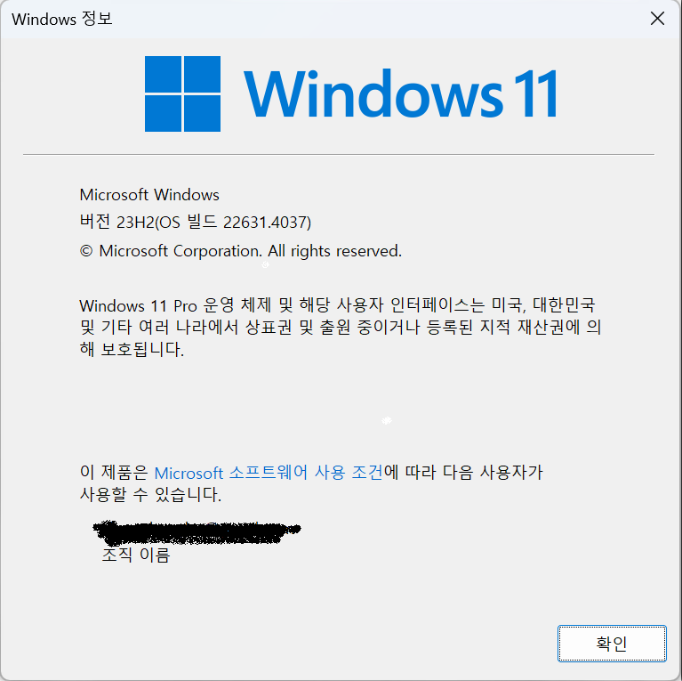

# 2. 파이썬 설치

[공식 웹 사이트](https://www.python.org/downloads/)

## 2.1 다운로드

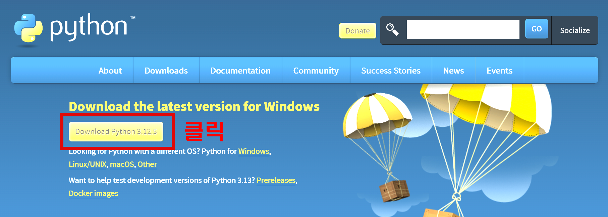

## 2.2 설치
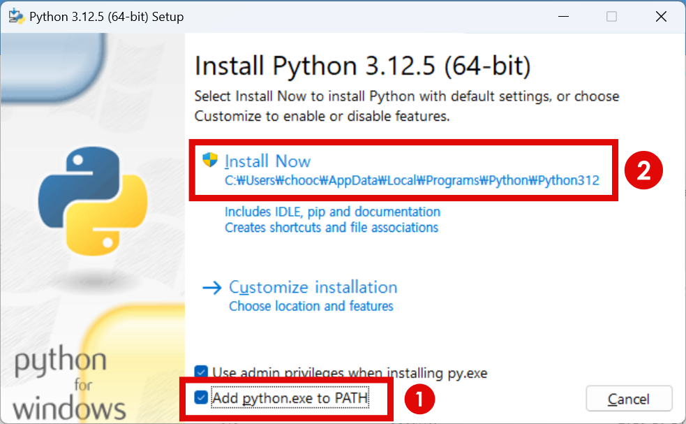
1. 'Add python.exe to PATH' 체크
2. 'Install Now' 클릭

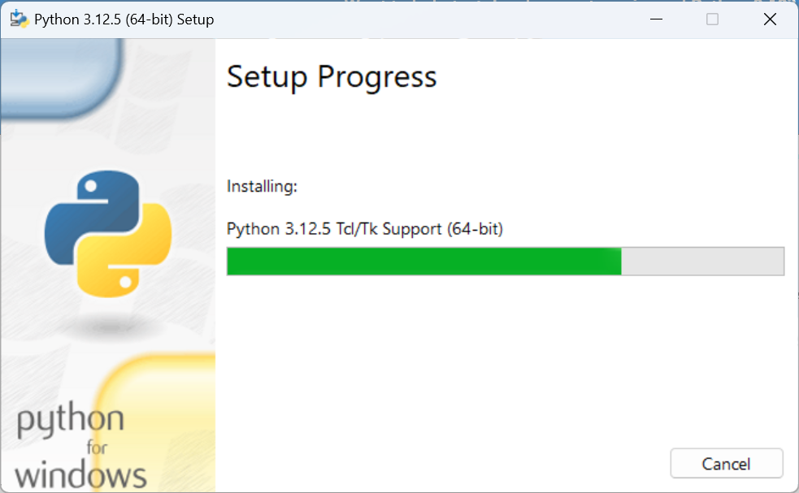


## 2.3 파이썬 기본 설정
이전에 다른 버전의 파이썬이 설치되어 있는 경우 기존 버전의 파이썬을 사용하도록 환경변수가 설정되어 있을 수 있다. 여기서는 새로운 버전의 파이썬을 사용하도록 환경 변수를 수정한다.


### 2.3.1 환경변수 수정

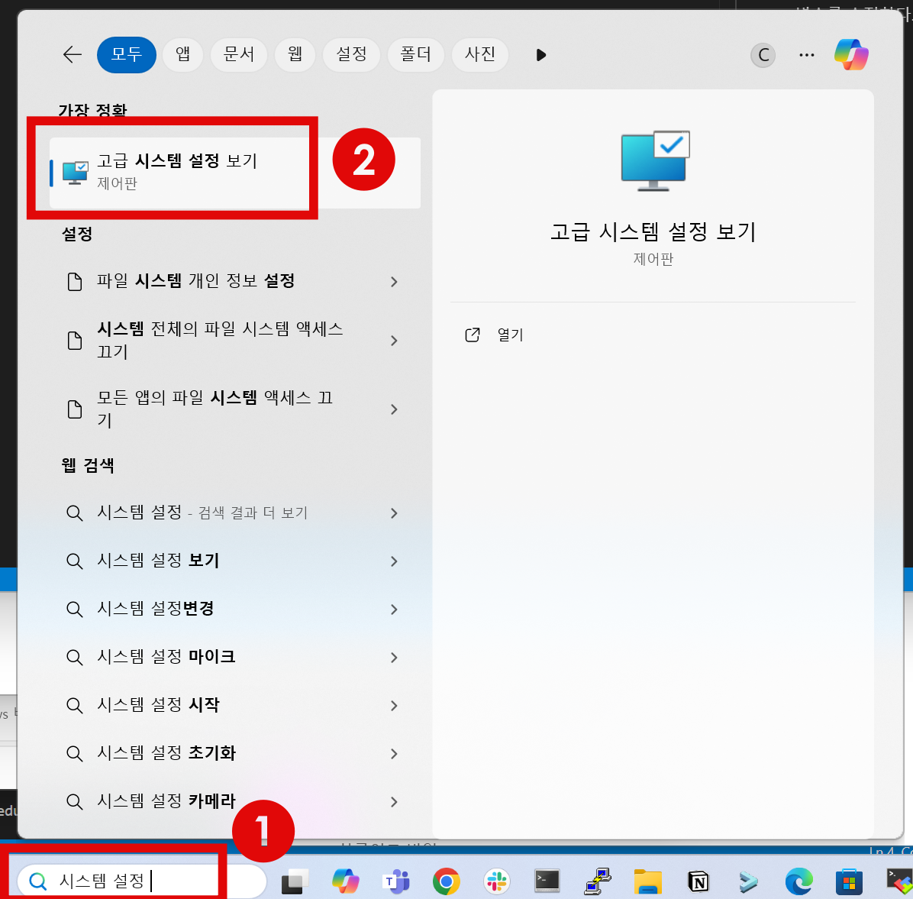
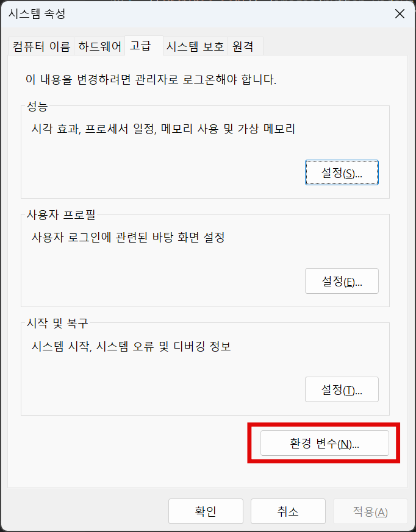
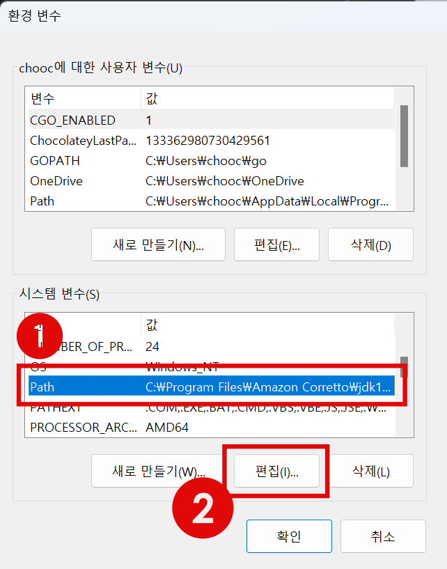
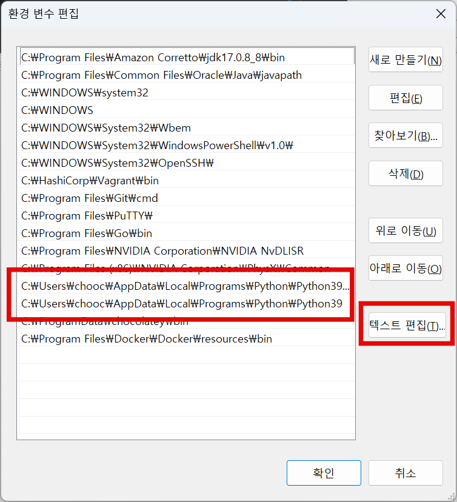
- C:\Users\{user name}\AppData\Local\Programs\Python\Python39\Scripts -> C:\Users\{user name}\AppData\Local\Programs\Python\Python312\Scripts

- C:\Users\{user name}\AppData\Local\Programs\Python\Python39 -> C:\Users\{user name}\AppData\Local\Programs\Python\Python312

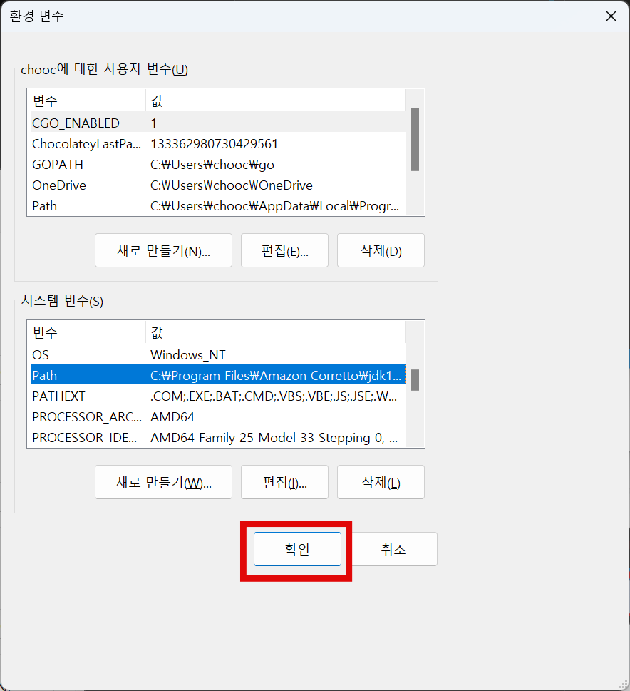

## 2.4 파이썬 버전 확인

윈도우 커맨드 창에서 버전 확인
```bash
c:\Users\chcoc> python --version
Python 3.12.5
```
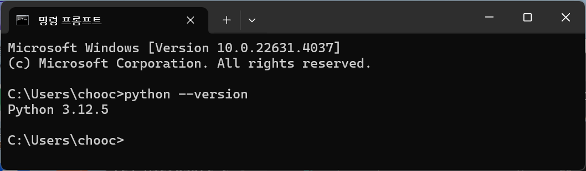

# 3. 프로젝트용 파이썬 버전 설치
시스템에 기본 설치된 최신 버전의 파이썬을 이용하여 프로젝트를 시작할 수 있으나 특정 버전이 필요한 경우 새로운 파이썬 버전을 새로 설치하고 사용하는 것보다 pyenv로 특정 버전을 설치하고 해당 프로젝트에서 사용하는 방법을 알아본다.

## 3.1 pyenv
[pyenv 공식 웹 사이트](https://github.com/pyenv-win/pyenv-win)

### 3.1.1 pyenv 설치

**Windows PowerShell** 을 관리자 권한으로 실행시킨다. 

먼저 'UnauthorizedAccess' 에러에 대응하기 위해 다음과 같은 커맨드를 먼저 실행한다.
```bash
PS C:\Users\chooc> Set-ExecutionPolicy -ExecutionPolicy RemoteSigned -Scope LocalMachine
```
이제 pyen를 설치한다.
```bash
PS C:\Users\chooc> Invoke-WebRequest -UseBasicParsing -Uri "https://raw.githubusercontent.com/pyenv-win/pyenv-win/master/pyenv-win/install-pyenv-win.ps1" -OutFile "./install-pyenv-win.ps1"; &"./install-pyenv-win.ps1"
```

전체 설치과정은 다음과 같다.
```bash
Windows PowerShell
Copyright (C) Microsoft Corporation. All rights reserved.
                                                                                                                        Install the latest PowerShell for new features and improvements! https://aka.ms/PSWindows                                                                                                                                                       PS C:\Users\chooc> Set-ExecutionPolicy -ExecutionPolicy RemoteSigned -Scope LocalMachine                                PS C:\Users\chooc> Invoke-WebRequest -UseBasicParsing -Uri "https://raw.githubusercontent.com/pyenv-win/pyenv-win/master/pyenv-win/install-pyenv-win.ps1" -OutFile "./install-pyenv-win.ps1"; &"./install-pyenv-win.ps1"


    Directory: C:\Users\chooc


Mode                 LastWriteTime         Length Name
----                 -------------         ------ ----
d-----        2024-08-24  오후 12:05                .pyenv                                                              
pyenv-win is successfully installed. You may need to close and reopen your terminal before using it.


PS C:\Users\chooc>
```

### 3.1.2 설치 확인

커맨드 창을 재 기동한다.
```bash
C:\Users\chooc\>pyenv --version
pyenv 3.1.1
```

### 3.1.3 기본 사용 방법
설치 가능한 파이썬 버전 확인
```bash
C:\Users\chooc>pyenv install --list
:: [Info] ::  Mirror: https://www.python.org/ftp/python
:: [Info] ::  Mirror: https://downloads.python.org/pypy/versions.json
:: [Info] ::  Mirror: https://api.github.com/repos/oracle/graalpython/releases
...
3.10.11-win32
3.10.11
3.11.0a1-win32
3.11.0a1
3.11.0a2-win32
3.11.0a2
...
C:\Users\chooc>
```

### 3.1.4 특정 버전설치(3.10.11)

```bash
C:\Users\chooc>pyenv install 3.10.11
:: [Info] ::  Mirror: https://www.python.org/ftp/python
:: [Info] ::  Mirror: https://downloads.python.org/pypy/versions.json
:: [Info] ::  Mirror: https://api.github.com/repos/oracle/graalpython/releases
:: [Downloading] ::  3.10.11 ...
:: [Downloading] ::  From https://www.python.org/ftp/python/3.10.11/python-3.10.11-amd64.exe
:: [Downloading] ::  To   C:\Users\chooc\.pyenv\pyenv-win\install_cache\python-3.10.11-amd64.exe
:: [Installing] ::  3.10.11 ...
:: [Info] :: completed! 3.10.11
```

### 3.1.5 설치된 버전 확인
```bash
PS D:\docs\python-windows-dev\projects> pyenv versions
  3.10.11
```

### 3.1.6 pyenv로 설치된 파이썬 경로 확인
```bash
PS D:\docs\python-windows-dev\projects> pyenv which python
C:\Users\chooc\.pyenv\pyenv-win\versions\3.10.11\python.exe
```
위의 경로에서 파이썬의 바이너리 뿐만 아니라 pip 도 확인할 수 있다.


## 3.2 virtualenv 로 파이썬 가상환경 만들기

### 3.2.1 virtualenv 설치

```bash
PS D:\docs\python-windows-dev\projects> C:\Users\chooc\.pyenv\pyenv-win\versions\3.10.11\scripts\pip.exe install virtualenv
Collecting virtualenv
  Using cached virtualenv-20.26.3-py3-none-any.whl (5.7 MB)
Collecting filelock<4,>=3.12.2
  Using cached filelock-3.15.4-py3-none-any.whl (16 kB)
Collecting platformdirs<5,>=3.9.1
  Using cached platformdirs-4.2.2-py3-none-any.whl (18 kB)
Collecting distlib<1,>=0.3.7
  Using cached distlib-0.3.8-py2.py3-none-any.whl (468 kB)
Installing collected packages: distlib, platformdirs, filelock, virtualenv
  WARNING: The script virtualenv.exe is installed in 'C:\Users\chooc\.pyenv\pyenv-win\versions\3.10.11\Scripts' which is not on PATH.
  Consider adding this directory to PATH or, if you prefer to suppress this warning, use --no-warn-script-location.
Successfully installed distlib-0.3.8 filelock-3.15.4 platformdirs-4.2.2 virtualenv-20.26.3

[notice] A new release of pip is available: 23.0.1 -> 24.2
[notice] To update, run: C:\Users\chooc\.pyenv\pyenv-win\versions\3.10.11\python.exe -m pip install --upgrade pip
PS D:\docs\python-windows-dev\projects>
```

### 3.2.2 가상환경 생성

```bash
PS D:\docs\python-windows-dev\projects> C:\Users\chooc\.pyenv\pyenv-win\versions\3.10.11\scripts\virtualenv.exe -p C:\Users\chooc\.pyenv\pyenv-win\versions\3.10.11\python.exe venv
created virtual environment CPython3.10.11.final.0-64 in 1271ms
  creator CPython3Windows(dest=D:\docs\python-windows-dev\projects\venv, clear=False, no_vcs_ignore=False, global=False)
  seeder FromAppData(download=False, pip=bundle, setuptools=bundle, wheel=bundle, via=copy, app_data_dir=C:\Users\chooc\AppData\Local\pypa\virtualenv)
    added seed packages: pip==24.1, setuptools==70.1.0, wheel==0.43.0
  activators BashActivator,BatchActivator,FishActivator,NushellActivator,PowerShellActivator,PythonActivator
```

- -p 옵션에 사용하고자 하는 파이썬 버전의 바이너리 패스를 지정한다
- venv 가상환경으로 생성되는 디렉토리명

### 3.2.3 가상환경 진입

```bash
PS D:\docs\python-windows-dev\projects> dir


    Directory: D:\docs\python-windows-dev\projects


Mode                 LastWriteTime         Length Name
----                 -------------         ------ ----
d-----        2024-08-24   오후 1:21                venv

-a----        2024-08-24  오후 12:51              9 .python-version
```

> [!CAUTION]
> PowerShell 에서는 가상환경진입이 정상적으로 이루어지지 않는다. PowerShell 대신 명령 프롬프트를 사용한다. 

```bash
D:\docs\python-windows-dev\projects>.\venv\Scripts\activate

D:\docs\python-windows-dev\projects>()

(venv) D:\docs\python-windows-dev\projects>
(venv) D:\docs\python-windows-dev\projects>
(venv) D:\docs\python-windows-dev\projects>
(venv) D:\docs\python-windows-dev\projects>python -V
Python 3.10.11
```

# 4. 소스 코드 클론

> [!NOTE]
> 별도의 소스코드가 준비되어 있다면 이부분은 생략합니다.

```bash
(venv) D:\docs\python-windows-dev\projects>git clone https://userid@github.com/repo/project.git
Cloning into 'project'...
```

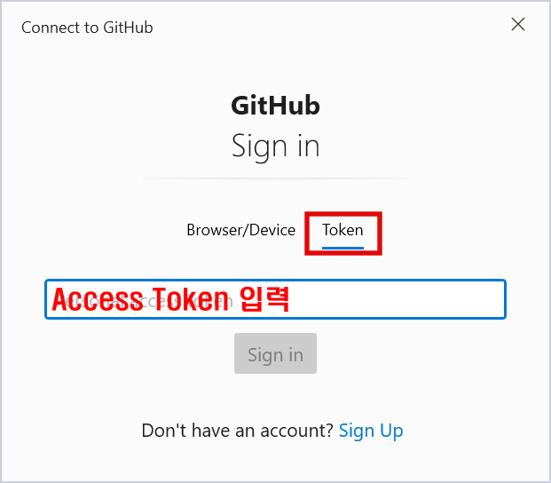

# 5. 패키지 설치
```bash
(venv) D:\docs\python-windows-dev\projects>cd project

(venv) D:\docs\python-windows-dev\projects\project>dir
 Volume in drive D is data
 Volume Serial Number is 9C6B-7307

 Directory of D:\docs\python-windows-dev\projects\project

2024-08-24  오후 01:32    <DIR>          .
2024-08-24  오후 01:29    <DIR>          ..
2024-08-24  오후 01:32               363 .gitignore
...
2024-08-24  오후 01:32             1,354 requirements.txt
...

(venv) D:\docs\python-windows-dev\projects\project> 
```