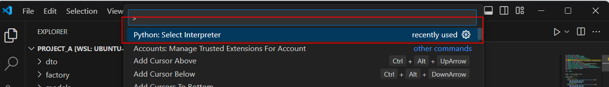
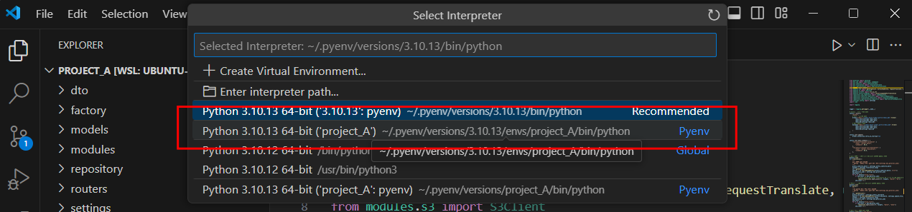
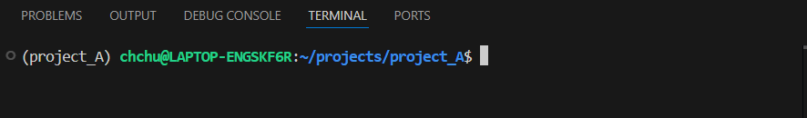

> [!CAUTION]
> 본 가이드는 윈도우의 WSL 환경을 기준으로 합니다.

> [!CAUTION]
> uvicorn 에서 사용하는 uvloop은 리눅스 계열에서만 설치가능 합니다.

> [!NOTE]
> vscode 는 WSL 에서 서버로 실행하여 코드 편집하는 것을 예로 합니다.

# 1 WSL 진입

명령 프롬프트 실행 후 'wsl' 입력합니다.

```bash
Microsoft Windows [Version 10.0.22631.4037]
(c) Microsoft Corporation. All rights reserved.

C:\Users\chooc>wsl
chchu@chchu:/mnt/c/Users/chooc$
```

> [!TIP]
> 위의 방법에서 에러가 발생한 경우 아래의 방법으로 실행한다.


우분투에 기본 설치된 파이썬 버전을 확인합니다.
```bash
chchu@chchu:/mnt/c/Users/chooc$ python3 -V
Python 3.10.6
```

# 2 pyenv

프로젝트마다 서로 다른 파이썬 버전이 필요할 수 있습니다.
pyenv 는 시스템에 여러 버전의 파이썬을 설치할 수 있도록 해줍니다. 

[pyenv](https://github.com/pyenv/pyenv)

## 2.1 설치

1. home 디렉토리로 이동
```bash
$ cd ~
```

2. pyenv 설치
```bash
$ curl https://pyenv.run | bash
```

3. PTH 추가
```bash
$ echo 'export PYENV_ROOT="$HOME/.pyenv"' >> ~/.bashrc
$ echo 'command -v pyenv >/dev/null || export PATH="$PYENV_ROOT/bin:$PATH"' >> ~/.bashrc
$ echo 'eval "$(pyenv init -)"' >> ~/.bashrc
```

전체 설치 과정 및 결과
```bash
chchu@chchu:/mnt/c/Users/chooc$ cd ~
chchu@chchu:~$ curl https://pyenv.run | bash
  % Total    % Received % Xferd  Average Speed   Time    Time     Time  Current
                                 Dload  Upload   Total   Spent    Left  Speed
100   270  100   270    0     0   4031      0 --:--:-- --:--:-- --:--:--  4090
Cloning into '/home/chchu/.pyenv'...
remote: Enumerating objects: 1273, done.
remote: Counting objects: 100% (1273/1273), done.
remote: Compressing objects: 100% (701/701), done.
remote: Total 1273 (delta 752), reused 737 (delta 439), pack-reused 0 (from 0)
Receiving objects: 100% (1273/1273), 630.40 KiB | 19.10 MiB/s, done.
Resolving deltas: 100% (752/752), done.
Cloning into '/home/chchu/.pyenv/plugins/pyenv-doctor'...
remote: Enumerating objects: 11, done.
remote: Counting objects: 100% (11/11), done.
remote: Compressing objects: 100% (9/9), done.
remote: Total 11 (delta 1), reused 5 (delta 0), pack-reused 0 (from 0)
Receiving objects: 100% (11/11), 38.72 KiB | 6.45 MiB/s, done.
Resolving deltas: 100% (1/1), done.
Cloning into '/home/chchu/.pyenv/plugins/pyenv-update'...
remote: Enumerating objects: 10, done.
remote: Counting objects: 100% (10/10), done.
remote: Compressing objects: 100% (6/6), done.
remote: Total 10 (delta 1), reused 5 (delta 0), pack-reused 0 (from 0)
Receiving objects: 100% (10/10), done.
Resolving deltas: 100% (1/1), done.
Cloning into '/home/chchu/.pyenv/plugins/pyenv-virtualenv'...
remote: Enumerating objects: 64, done.
remote: Counting objects: 100% (64/64), done.
remote: Compressing objects: 100% (56/56), done.
remote: Total 64 (delta 10), reused 27 (delta 1), pack-reused 0 (from 0)
Receiving objects: 100% (64/64), 41.90 KiB | 6.98 MiB/s, done.
Resolving deltas: 100% (10/10), done.

WARNING: seems you still have not added 'pyenv' to the load path.

# Load pyenv automatically by appending
# the following to
# ~/.bash_profile if it exists, otherwise ~/.profile (for login shells)
# and ~/.bashrc (for interactive shells) :

export PYENV_ROOT="$HOME/.pyenv"
[[ -d $PYENV_ROOT/bin ]] && export PATH="$PYENV_ROOT/bin:$PATH"
eval "$(pyenv init -)"

# Restart your shell for the changes to take effect.

# Load pyenv-virtualenv automatically by adding
# the following to ~/.bashrc:

eval "$(pyenv virtualenv-init -)"

chchu@chchu:~$ echo 'export PYENV_ROOT="$HOME/.pyenv"' >> ~/.bashrc
chchu@chchu:~$ echo 'command -v pyenv >/dev/null || export PATH="$PYENV_ROOT/bin:$PATH"' >> ~/.bashrc
chchu@chchu:~$ echo 'eval "$(pyenv init -)"' >> ~/.bashrc
```

## 2.2 설치 확인

```bash
chchu@chchu:~$ source ~/.bashrc
chchu@chchu:~$ pyenv -v
pyenv 2.4.10
```

## 2.3 설치 가능한 python 버전 확인

```bash
chchu@chchu:~$ pyenv install --list
Available versions:
  ...
  3.10.13
  3.10.14
  ...
```

## 2.4 특정 버전의 파이썬 설치

dependecy package 설치

```bash
$ sudo apt update
$ sudo apt install build-essential zlib1g-dev libncurses5-dev libgdbm-dev libnss3-dev libssl-dev libreadline-dev libffi-dev liblzma-dev libbz2-dev libsqlite3-dev tk-dev
```

파이썬 설치

```bash
$ pyenv install 3.10.13
```

# 3. python 가상환경 만들기

프로젝트 디렉토리를 생성합니다.

```bash
$ mkdir projects
$ cd projects
$ mkdir project_A
$ cd project_A
```

# 4. 프로젝트를 위한 pyenv 가상환경 생성

앞서 생성한 파이썬 3.10.13 버전을 베이스로 특정 프로젝트에서 사용할 가상환경을 생성합니다.

생성된 가상환경에 프로젝트에 필요한 패키지를 설치하여 시스템에 설치된 파이썬과 환경을 분리합니다.

```bash
$ pyenv virtualenv 3.10.13 project_A
```

생성된 가상환경의 경로를 확인합니다.

```bash
$ pyenv virtualenvs
  3.10.13/envs/project_A (created from /home/username/.pyenv/versions/3.10.13)
  project_A (created from /home/username/.pyenv/versions/3.10.13)
$ ls ~/.pyenv/versions/
3.10.13  project_A
```
/home/username/.pyenv/version 디렉토리에서 방금 생성한 가상환경을 확인할 수 있습니다.

# 5. pyenv 가상환경 진입
쉘에서 해당 프로젝트에 필요한 작업을 수행하기 위해 가상환경으로 생성해둔 파이썬을 포함한 기타 바이너리를 사용할 수 있어야 합니다.

프로젝트 폴더에 들어오면 자동으로 이미 생성해둔 가상환경으로 진입할 수 있도록 합니다.

```bash
$ cd projects/project_A
$ pyenv local project_A
$ python -V
Python 3.10.13
```

> [!CAUTION]
> pyenv virtualenv 명령 실행 이후 해당 디렉토리에 .python-version 이 생성되므로 SCM 에 포함되지 않도록 주의한다.

# 6. 소스코드 클론

```bash
chchu@chchu:~/projects/project_A$ git clone https://github.com/repository/project.git .
Cloning into '.'...
Username for 'https://github.com': <username>
Password for 'https://username@github.com':
remote: Enumerating objects: 2070, done.
remote: Counting objects: 100% (2070/2070), done.
remote: Compressing objects: 100% (1787/1787), done.
remote: Total 2070 (delta 295), reused 2042 (delta 267), pack-reused 0 (from 0)
Receiving objects: 100% (2070/2070), 5.41 MiB | 16.95 MiB/s, done.
Resolving deltas: 100% (295/295), done.
```

# 5. 파이썬 패키지 설치

> [!TIP]
> mysqlclient 패키지 설치시 에러가 발생할 수 있다.

```bash
Collecting mysqlclient==2.2.4
  Downloading mysqlclient-2.2.4.tar.gz (90 kB)
     ━━━━━━━━━━━━━━━━━━━━━━━━━━━━━━━━━━━━━━━━ 90.4/90.4 kB 18.8 MB/s eta 0:00:00
  Installing build dependencies ... done
  Getting requirements to build wheel ... error
  error: subprocess-exited-with-error

  × Getting requirements to build wheel did not run successfully.
  │ exit code: 1
  ╰─> [24 lines of output]
      Trying pkg-config --exists mysqlclient
      Command 'pkg-config --exists mysqlclient' returned non-zero exit status 1.
      Trying pkg-config --exists mariadb
      Command 'pkg-config --exists mariadb' returned non-zero exit status 1.
      Trying pkg-config --exists libmariadb
      Command 'pkg-config --exists libmariadb' returned non-zero exit status 1.
      Traceback (most recent call last):
        File "/home/chchu/.pyenv/versions/3.10.13/lib/python3.10/site-packages/pip/_vendor/pyproject_hooks/_in_process/_in_process.py", line 353, in <module>
          main()
        File "/home/chchu/.pyenv/versions/3.10.13/lib/python3.10/site-packages/pip/_vendor/pyproject_hooks/_in_process/_in_process.py", line 335, in main
          json_out['return_val'] = hook(**hook_input['kwargs'])
        File "/home/chchu/.pyenv/versions/3.10.13/lib/python3.10/site-packages/pip/_vendor/pyproject_hooks/_in_process/_in_process.py", line 118, in get_requires_for_build_wheel
          return hook(config_settings)
        File "/tmp/pip-build-env-kn7os715/overlay/lib/python3.10/site-packages/setuptools/build_meta.py", line 332, in get_requires_for_build_wheel
          return self._get_build_requires(config_settings, requirements=[])
        File "/tmp/pip-build-env-kn7os715/overlay/lib/python3.10/site-packages/setuptools/build_meta.py", line 302, in _get_build_requires
          self.run_setup()
        File "/tmp/pip-build-env-kn7os715/overlay/lib/python3.10/site-packages/setuptools/build_meta.py", line 318, in run_setup
          exec(code, locals())
        File "<string>", line 155, in <module>
        File "<string>", line 49, in get_config_posix
        File "<string>", line 28, in find_package_name
      Exception: Can not find valid pkg-config name.
      Specify MYSQLCLIENT_CFLAGS and MYSQLCLIENT_LDFLAGS env vars manually
      [end of output]

  note: This error originates from a subprocess, and is likely not a problem with pip.
error: subprocess-exited-with-error

× Getting requirements to build wheel did not run successfully.
│ exit code: 1
╰─> See above for output.

note: This error originates from a subprocess, and is likely not a problem with pip.
```

먼저 libmysqlclient-dev 을 설치합니다.

```bash
chchu@chchu:~/projects/project_A$ sudo apt install libmysqlclient-dev
[sudo] password for chchu:
Reading package lists... Done
Building dependency tree... Done
Reading state information... Done
The following additional packages will be installed:
  libmysqlclient21 libzstd-dev mysql-common
The following NEW packages will be installed:
  libmysqlclient-dev libmysqlclient21 libzstd-dev mysql-common
0 upgraded, 4 newly installed, 0 to remove and 122 not upgraded.
Need to get 3367 kB of archives.
After this operation, 17.4 MB of additional disk space will be used.
Do you want to continue? [Y/n] Y
Get:1 http://archive.ubuntu.com/ubuntu jammy/main amd64 mysql-common all 5.8+1.0.8 [7212 B]
Get:2 http://archive.ubuntu.com/ubuntu jammy-updates/main amd64 libmysqlclient21 amd64 8.0.39-0ubuntu0.22.04.1 [1301 kB]
Get:3 http://archive.ubuntu.com/ubuntu jammy/main amd64 libzstd-dev amd64 1.4.8+dfsg-3build1 [401 kB]
Get:4 http://archive.ubuntu.com/ubuntu jammy-updates/main amd64 libmysqlclient-dev amd64 8.0.39-0ubuntu0.22.04.1 [1658 kB]
Fetched 3367 kB in 3s (1092 kB/s)
Selecting previously unselected package mysql-common.
(Reading database ... 32164 files and directories currently installed.)
Preparing to unpack .../mysql-common_5.8+1.0.8_all.deb ...
Unpacking mysql-common (5.8+1.0.8) ...
Selecting previously unselected package libmysqlclient21:amd64.
Preparing to unpack .../libmysqlclient21_8.0.39-0ubuntu0.22.04.1_amd64.deb ...
Unpacking libmysqlclient21:amd64 (8.0.39-0ubuntu0.22.04.1) ...
Selecting previously unselected package libzstd-dev:amd64.
Preparing to unpack .../libzstd-dev_1.4.8+dfsg-3build1_amd64.deb ...
Unpacking libzstd-dev:amd64 (1.4.8+dfsg-3build1) ...
Selecting previously unselected package libmysqlclient-dev.
Preparing to unpack .../libmysqlclient-dev_8.0.39-0ubuntu0.22.04.1_amd64.deb ...
Unpacking libmysqlclient-dev (8.0.39-0ubuntu0.22.04.1) ...
Setting up mysql-common (5.8+1.0.8) ...
update-alternatives: using /etc/mysql/my.cnf.fallback to provide /etc/mysql/my.cnf (my.cnf) in auto mode
Setting up libmysqlclient21:amd64 (8.0.39-0ubuntu0.22.04.1) ...
Setting up libzstd-dev:amd64 (1.4.8+dfsg-3build1) ...
Setting up libmysqlclient-dev (8.0.39-0ubuntu0.22.04.1) ...
Processing triggers for man-db (2.10.2-1) ...
Processing triggers for libc-bin (2.35-0ubuntu3.4) ...
```

이제 프로젝트에 필요한 파이썬 패키지를 설치합니다.

```bash
chchu@chchu:~/projects/project_A$ pip install -r requirements.txt
```

# 6. Docker 

> [!NOTE]
> 호스트 시스템에 Docker Desktop이 이미 설치되어있다고 가정한 후 진행합니다.

## 6.1 mysql

명령 프롬프트를 하나 더 실행 합니다.

- 포트 : 3306
- root  패스워드 : rootpassword

```bash
C:\Users\chooc>docker run --name mysql-8.0.36 -e MYSQL_ROOT_PASSWORD=rootpassword -d -p 3306:3306 mysql:8.0.36
Unable to find image 'mysql:8.0.36' locally
8.0.36: Pulling from library/mysql
bd37f6d99203: Pull complete
d2433cba0951: Pull complete
13702d9fe3c3: Pull complete
83bcc87284a1: Pull complete
c38d8660e1fa: Pull complete
7e1bc321f421: Pull complete
bddd54b9c549: Pull complete
4eaae1e844ac: Pull complete
5196e1e87d8f: Pull complete
6586d096303c: Pull complete
cf55ff1c80af: Pull complete
Digest: sha256:a532724022429812ec797c285c1b540a644c15e248579c6bfdf12a8fbaab4964
Status: Downloaded newer image for mysql:8.0.36
0fa644a4395a87aeb6ad0112772bc228aa118c1f6e2f83a5ec3b80e10e335039
```


## 6.2 redis

```bash
C:\Users\chooc>docker run -p 6379:6379 --name redis -d redis:latest [--requirepass "password"]
2ecfcbd8f9e42ab11f277533b877720136f4d297af8b4badbf226f1824cd9010
```

# 7 VSCode

WSL에 저장된 파이썬 프로젝트를 vscode에서 개발하기 위한 방법입니다.

## 7.1 WSL 에서 vscode 실행

프로젝트 루트 디렉토리에서 아래와 같이 실행합니다.

```bash
$ code .
```

## 7.2 Extention 설치

- WSL
- Python


## 7.2 VScode 프로젝트 설정

이제 WSL 에 생성한 파이썬 가상환경을 프로젝트에서 사용할 파이썬 인터프리터로 설정합니다.

Ctrl + Shift + P 를 누르고 'Python: Select Interpreter' 를 선택합니다.




VScode 에서 터미널을 실행하고 프로젝트의 파이썬 버전을 확인합니다.


파이썬 버전을 확인합니다.



# 8. 프로젝트 실행

## 8.1 uvicorn 으로 fastAPI 실행

```bash
$ uvicorn main:app --host 0.0.0.0 --reload
```

## 8.2 [celery] worker 실행

비동기 타스크 실행

```bash
$ celery -A worker.celery worker --loglevel=info
```

## 8.3 [celery] beat 실행

주기적으로 실행되는 타스크 실행 

```bash
$ celery -A worker.celery beat -l info
```